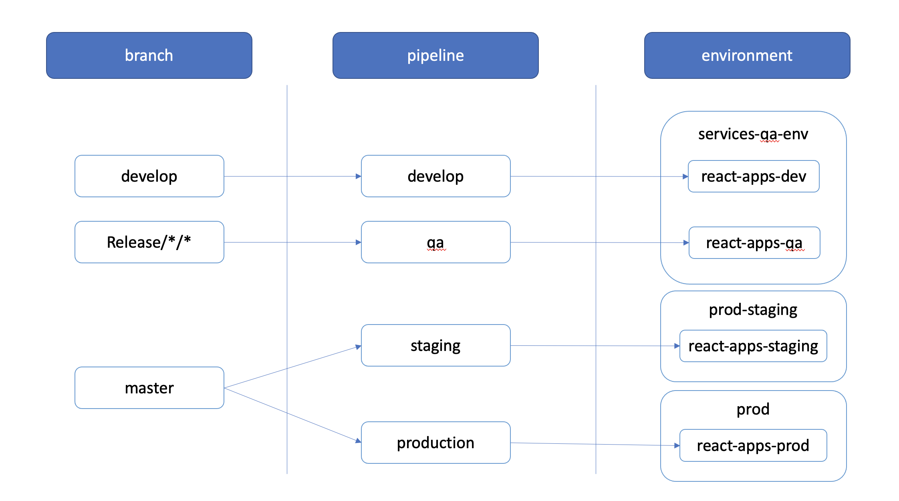

# Devops Pipelines & Templates

This directory holds the templates and pipeline definitions used by this project.
All pipelines are tested and written for Azure Pipelines.

each pipeline in below list:
- runs on each push and Pull Request made against targeted branch
- If the pipeline is running for a PR, it will run the tests and skip
deployment.
- Once the PR is merged or if there is a direct push to the targeted
branch, a test + deployment will happen.

**Pipelines**

 - `develop.yml` 
	 - Targets `develop` branch.
	 - Deploys on `react-apps-dev` K8s namespace within `services-qa-env` Environment in Azure, which is connected to `ecms-useast-dev-cluster`.
 - `qa.yml` 
	 - Targets `release/*/*` branches.
	 - Deploys on `react-apps-qa` K8s namespace within `services-qa-env` Environment in Azure, which is connected to `ecms-useast-dev-cluster`.
  - `staging.yml` 
	 - Targets `master` branches.
	 - deploys on `react-apps-staging` K8s namespace within `prod-staging` Environment in Azure, which is connected to `ecms-northcentral-production-cluster`.
 - `production.yml` 
	 - Targets `master` branches.
	 - Deploys on `react-apps-prod` K8s namespace within `prod` Environment in Azure

## UAT Pipelines

 - `dev-uat-billing-portal.yml`
 - `dev-uat-safety-intelligence.yml`
 - `develop-uat.yml`
 - `qa-uat-self-signup.yml`

These pipelines run after the `develop` Pipeline has deployed to the `dev` environment, with a delay of 5 minutes. Additionally, these pipelines run daily - midnight

The result of the run is posted in the Services Internal Chat > Deployment channel in Teams.

## Manual pipelines

 - `qa-da-deploy.yml` this is specifically built for DA squad to deploy DA apps on demand
