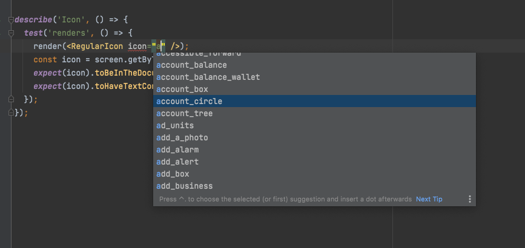

# Material Design Icons

According to our Iconography styleguide, we use the **Outlined** and **Regular (filled)** version of Material Design Icons.

The best way to integrate with Material Design Icon Library is to use their Icon Fonts hosted by Google Fonts, found here:

https://fonts.google.com/icons?icon.style=Outlined

The following reasons make Icon fonts more suitable for our use case:
- SVGs are not widely supported on all browsers
- Bundling SVG Icons can increase bundle size
- Icon font files are cached separately and served by Google Fonts directly (which is known to be good at delivery speeds and caching)
- We will get faster updates when Material Design icons are updated, compared to downstream packaged maintained by `@material/icons` or `@mui/icons-material`

The `Icon` component helps render these icons by abstracting out Material Icons specific code so that in future we may swap it out.

## Generating types from Material Design Icons

Since we're not using `@material/icons` or `@mui/icons-material`, we do not get type hinting as to what icons are available.

Therefore, we have added a script in this package that can pull in available icons from Google's 
git repo (https://github.com/google/material-design-icons/blob/master/font/)
and convert them to Typescript string literal types. 

This has to following benefits:
- It won't increase build sizes, because Typescript string literals are dropped during build
- It will give us type hinting as to what icons are available, therefore saving developer time spent in finding correct icon names
- If we ever decide to change which implementation of Material Icons to go with, this abstraction will help

